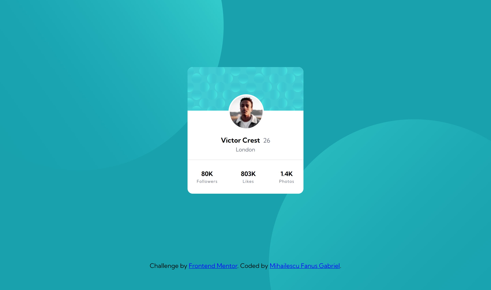

# Frontend Mentor - Profile card component solution

This is a solution to the [Profile card component challenge on Frontend Mentor](https://www.frontendmentor.io/challenges/profile-card-component-cfArpWshJ). Frontend Mentor challenges help you improve your coding skills by building realistic projects. 

## Table of contents

- [Overview](#overview)
  - [The challenge](#the-challenge)
  - [Screenshot](#screenshot)
  - [Links](#links)
- [My process](#my-process)
  - [Built with](#built-with)
  - [What I learned](#what-i-learned)
  - [Continued development](#continued-development)
  - [Useful resources](#useful-resources)
- [Author](#author)
- [Acknowledgments](#acknowledgments)

**Note: Delete this note and update the table of contents based on what sections you keep.**

## Overview

### The challenge

- Build out the project to the designs provided

### Screenshot

### Links

- Solution URL: [Add solution URL here](https://your-solution-url.com)
- Live Site URL: [Add live site URL here](https://your-live-site-url.com)

## My process

### Built with

- Semantic HTML5 markup
- Flexbox
- SASS
- Mobile-first workflow

### What I learned

Today I learned a little bit more about working with images as backgrounds. I had the pleasure to play with positioning: absolute and pseudo classes in order to rotate and size up the background without modifing the card component.

This article helped me understand a bit more what I was working with : [How to Apply CSS3 Transforms to Background Images](https://www.sitepoint.com/css3-transform-background-image/)

## Author

- Website - [Mihailescu Fanush Gabriel](https://fanushhh.github.io/Stylized-Website/)
- Frontend Mentor - [@yourusername](https://www.frontendmentor.io/profile/Fanushh)

